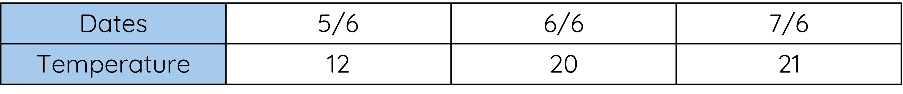

# Parrllel 1D Arrays

## Explanation

You already know that an array is a list of related values, called elements, that can be referred to by number, e.g. temperature[0], temperature[5] etc. 

<figure markdown="span">
  { width="800" }
</figure>


This example below now adds a second array that records the date on which the temperature was taken.

We can look up the temperature on the 8th of June, by looking for that date, and reading the corresponding temperature __(14°)__. 

__These are parallel arrays, because we can look up corresponding values, like a table.__

<figure markdown="span">
  { width="800" }
</figure>

<!---{ width="300" }-->

In this example, pupil marks are stored in one array, and pupil names are stored in another. 

__We can see that Jack scored 23, and Lucy scored 24, by looking at the two arrays side-by-side, as if they were a table.__

<figure markdown="span">
  { width="800" }
</figure>

There is no special syntax or different way to write these.

__We just declare two arrays.__

!!! example
	
	```Python
 
	          # Two *parallel* arrays of pupil names and marks
	          pupil_name = ["Peter", "Laura", "Marie"]
	          pupil_mark = [20, 21, 23]
	          
	          # If we want to find the name and mark of the third pupil in the list, we would say:
	          print(pupil_name[2])
	          print(pupil_mark[2])
	  
	```

## Working with Files

This example is based on the Schools-Reg.csv file from earlier

<figure markdown="span">
  { width="800" }
</figure>

 
